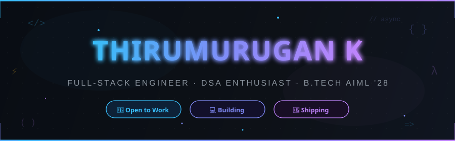
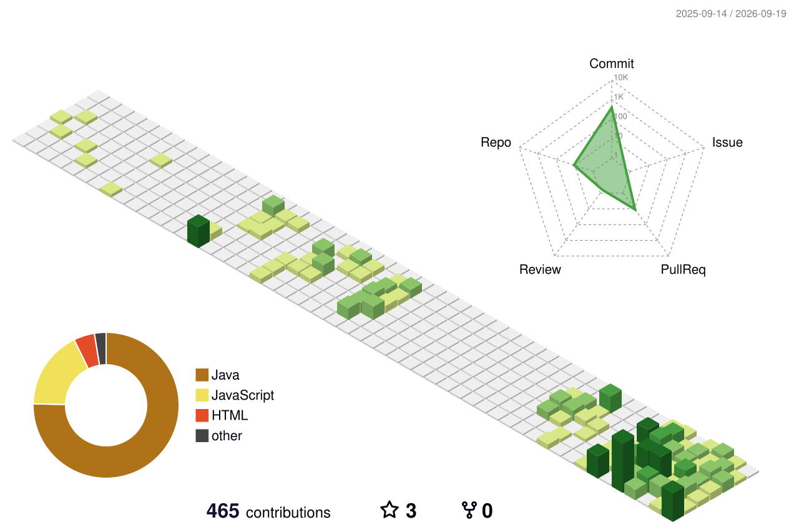

<div align="center">

<!-- ═══════════════════════════════════════════════════════════ -->
<!-- 🎨 CUSTOM ANIMATED HEADER BANNER                          -->
<!-- ═══════════════════════════════════════════════════════════ -->


<br/>

<!-- ANIMATED TYPING HEADER -->
<a href="https://git.io/typing-svg">
  
</a>

<br/><br/>

<!-- SOCIAL BADGES -->
<a href="https://www.linkedin.com/in/thirumurugan007/" target="_blank">
  
</a>
<a href="https://leetcode.com/thirumurugan007" target="_blank">
  
</a>
<a href="https://codeforces.com/profile/thirumurugan27" target="_blank">
  
</a>
<a href="https://thirumurugan.site" target="_blank">
  
</a>
<a href="mailto:thirumurugan020070@gmail.com" target="_blank">
  
</a>

</div>

<br/>

<!-- ═══════════════════════════════════════════════════════════ -->

<!-- ═══════════════════════════════════════════════════════════ -->

##  About Me

```javascript
const thirumurugan = {
  pronouns: "he/him",
  role: "Software Engineering Student & Full-Stack Builder",
  degree: "B.Tech AIML — Class of 2028 🎓",
  cgpa: "8.66 / 10",
  code: ["Java", "JavaScript", "Python", "C++", "C"],
  stack: ["React", "React Native", "Node.js", "Express", "MySQL", "AWS"],
  currentQuest: "Grinding DSA & shipping high-performance full-stack apps",
  superpower: "Converting coffee into clean code and zero-warning builds ☕",
  philosophy: "If it ain't broken, refactor it until it is, then fix it properly 🛠️"
};
```

I'm an AIML undergraduate passionate about engineering scalable, high-performance systems and conquering hard algorithmic problems. From crafting reactive web & mobile interfaces with **React & React Native** to designing resilient backends with **Node.js/Express** backed by **MySQL**, I enjoy turning complex challenges into clean, elegant code.

- 🎯 **Target:** SDE / Software Engineering roles at product-driven tech companies
- 💬 **Ask me about:** Data Structures & Algorithms, React, Node.js, System Architecture
- ⚡ **Fun Fact:** I'd rather stay up hunting down a race condition at 2 AM than wake up to unresolved bugs

<br/>

<!-- ANIMATED TERMINAL -->
<div align="center">
  
</div>

<br/>

<!-- ═══════════════════════════════════════════════════════════ -->

<!-- ═══════════════════════════════════════════════════════════ -->

## 🛠️ Tech Stack & Arsenal

<div align="center">

<!-- ANIMATED MARQUEE -->


<br/><br/>

### 💻 Languages
<p>
  
</p>

### 🌐 Frontend & Mobile
<p>
  
</p>
<sub><i>React powers both my <b>Web</b> and <b>React Native</b> mobile development.</i></sub>

<br/>

### ⚙️ Backend & Database
<p>
  
</p>

### ☁️ Cloud, DevOps & Tools
<p>
  
</p>

</div>

<br/>

<!-- ═══════════════════════════════════════════════════════════ -->

<!-- ═══════════════════════════════════════════════════════════ -->

## 🏆 GitHub Trophies

<div align="center">


</div>

<br/>

<!-- ═══════════════════════════════════════════════════════════ -->

<!-- ═══════════════════════════════════════════════════════════ -->

## 🐍 Contribution Stream

<div align="center">

<!-- Snake Animation -->
<picture>
  <source media="(prefers-color-scheme: dark)" srcset="https://raw.githubusercontent.com/thirumurugan27/thirumurugan27/output/github-contribution-grid-snake-dark.svg" />
  <source media="(prefers-color-scheme: light)" srcset="https://raw.githubusercontent.com/thirumurugan27/thirumurugan27/output/github-contribution-grid-snake.svg" />
  
</picture>

<sub><i>Daily automated snake eating up commits via GitHub Actions 🟢</i></sub>

<br/><br/>

<!-- 3D Contribution Graph -->


<sub><i>Isometric 3D contribution graph — auto-generated daily ✨</i></sub>

</div>

<br/>

<!-- ═══════════════════════════════════════════════════════════ -->

<!-- ═══════════════════════════════════════════════════════════ -->

## 📊 GitHub Analytics

<div align="center">


&nbsp;


<br/><br/>


<br/><br/>

<!-- Activity Graph -->


</div>

<br/>

<!-- ═══════════════════════════════════════════════════════════ -->

<!-- ═══════════════════════════════════════════════════════════ -->

## 🧩 Problem Solving & Competitive Coding

<div align="center">

<a href="https://leetcode.com/thirumurugan007" target="_blank">
  
</a>

<p><sub>⚡ Live stats fetched directly from LeetCode — daily streak & problem milestones.</sub></p>

</div>

<br/>

<!-- ═══════════════════════════════════════════════════════════ -->

<!-- ═══════════════════════════════════════════════════════════ -->

## 💭 Dev Quote of the Day

<div align="center">


</div>

<br/>

<!-- ═══════════════════════════════════════════════════════════ -->

<!-- ═══════════════════════════════════════════════════════════ -->

## 🎓 Education

<div align="center">

```
🏛️  B.Tech in Artificial Intelligence & Machine Learning
📅  Expected Graduation: 2028
🎯  Academic Standing: CGPA 8.66 / 10
```

</div>

<br/>

<!-- ═══════════════════════════════════════════════════════════ -->

<!-- ═══════════════════════════════════════════════════════════ -->

## 📫 Let's Connect & Collaborate

<div align="center">

<p>Whether it's discussing an innovative tech project, an open SDE role, or just geeking out over algorithms — my inbox is always open!</p>

<a href="https://www.linkedin.com/in/thirumurugan007/"></a>
<a href="https://github.com/thirumurugan27"></a>
<a href="https://leetcode.com/thirumurugan007"></a>
<a href="https://codeforces.com/profile/thirumurugan27"></a>
<a href="https://thirumurugan.site"></a>
<a href="mailto:thirumurugan020070@gmail.com"></a>

<br/><br/>

<a href="https://git.io/typing-svg">
  
</a>

<br/>

<!-- ANIMATED FOOTER -->


</div>